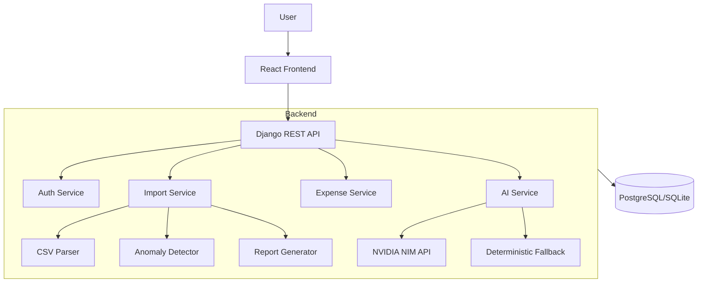

# LedgerLens AI — AI-Powered Expense Intelligence Platform

A professional expense intelligence platform for data ingestion, anomaly detection, and AI-powered insights. Built with Django (backend) and React + Vite (frontend).

## Badges

[](https://github.com/rajkiranraj/ledgerlens/actions/workflows/ci.yml)
[](https://opensource.org/licenses/MIT)
[](https://www.python.org/)
[](https://react.dev/)

## Problem Statement

Modern businesses generate massive volumes of expense data from multiple sources. Manual data entry and validation are error-prone, time-consuming, and provide limited actionable insights. Organizations need a platform that can:

- Ingest expense data from CSV files
- Automatically detect anomalies (duplicates, invalid dates, missing data, etc.)
- Provide AI-powered analytics and insights
- Generate comprehensive audit-ready reports
- Maintain high data quality standards

## Key Features

### CSV Ingestion

- Robust CSV parsing with support for malformed files
- Automatic column detection and data type inference
- Progress tracking during import
- Support for multiple currencies (USD, INR, EUR)

### Anomaly Detection

- 12+ anomaly types detected automatically
- Severity-based categorization (Info to Warning to Error to Critical)
- Auto-correction for recoverable issues
- Detailed anomaly log with action taken

### AI Insights

- NVIDIA NIM integration for intelligent analysis
- Graceful fallbacks to deterministic logic if AI fails
- Executive summaries of expense trends
- Anomaly impact assessments

### Import Reporting

- Comprehensive reports with total rows, imported, corrected, rejected counts
- Anomaly summary by type
- Audit trail of all import actions
- Export to JSON and PDF

### Analytics Dashboard

- Real-time expense analytics
- Spending by category
- Monthly trends
- Anomaly rate tracking
- Historical import history

## Architecture Diagram



## Database Schema

### Core Entities

| Entity            | Description                                 |
| ----------------- | ------------------------------------------- |
| `User`            | Standard Django user with profile extension |
| `Group`           | Organization/group for expense tracking     |
| `GroupMembership` | Member relationships within groups          |
| `Expense`         | Individual expense record                   |
| `ExpenseSplit`    | Split details for shared expenses           |
| `Settlement`      | Settlement transactions between users       |
| `Category`        | Expense categories for validation           |

### Import & Anomaly Entities

| Entity         | Description                              |
| -------------- | ---------------------------------------- |
| `Import`       | Tracks CSV import sessions end-to-end    |
| `Anomaly`      | Detailed record of each detected anomaly |
| `ImportReport` | Full import report with audit trail      |

### Key Relationships

- 1 `Group` → many `Expense`, `Settlement`, `Import`, `Category`
- 1 `Import` → many `Anomaly`
- 1 `Import` → 1 `ImportReport`
- 1 `Expense` → many `ExpenseSplit`

## API Endpoints

### Authentication

- `POST /api/auth/login/`: User login
- `GET /api/auth/status/`: Check auth status

### Groups

- `GET /api/groups/`: List groups
- `POST /api/groups/`: Create group
- `GET /api/groups/<group_id>/members/`: List members
- `POST /api/groups/<group_id>/members/`: Add member

### Expenses & Settlements

- `GET /api/groups/<group_id>/expenses/`: List expenses
- `POST /api/groups/<group_id>/expenses/`: Create expense
- `DELETE /api/groups/<group_id>/expenses/<id>/`: Delete expense
- `GET /api/groups/<group_id>/settlements/`: List settlements
- `POST /api/groups/<group_id>/settlements/`: Create settlement
- `DELETE /api/groups/<group_id>/settlements/<id>/`: Delete settlement

### Balances & Analytics

- `GET /api/groups/<group_id>/balances/`: Get balances and minimized debts
- `GET /api/groups/<group_id>/analytics/`: Get analytics dashboard data

### Import Pipeline

- `POST /api/groups/<group_id>/import/parse/`: Parse CSV
- `POST /api/groups/<group_id>/import/confirm/`: Confirm and complete import
- `GET /api/groups/<group_id>/imports/`: List import history
- `GET /api/groups/<group_id>/imports/<id>/report/`: Get import report

### AI Integration

- `POST /api/groups/<group_id>/ai/insights/`: Generate AI insights
- `POST /api/groups/<group_id>/ai/import-summary/<id>/`: Generate AI import summary

## Deployment Instructions

### Frontend (Cloudflare Pages)

1. Build the frontend:

   ```bash
   cd frontend/my-app
   npm install
   npm run build
   ```

2. Deploy to Cloudflare Pages:
   - Connect your GitHub repository
   - Set build command: `npm run build`
   - Set output directory: `frontend/my-app/dist`
   - Add environment variable: `VITE_API_URL` pointing to your backend

### Backend (Railway)

1. Deploy to Railway:
   - Connect your GitHub repository
   - Set root directory: `backend`
   - Add PostgreSQL database
   - Set environment variables:
     - `DATABASE_URL` (from Railway PostgreSQL)
     - `NVIDIA_NIM_API_KEY` (optional)
     - `SECRET_KEY` (Django secret)

2. Run migrations:
   ```bash
   python manage.py migrate
   python manage.py createsuperuser
   ```

## AI Integration

### NVIDIA NIM Usage

- **Model**: NVIDIA Llama 3.1 405B Instruct (configurable)
- **Purpose**: Generating insights and import summaries
- **Fallback Behavior**: If NVIDIA NIM API fails or no key provided, uses deterministic logic
- **Caching**: Results cached for 1 hour with TTL

### Prompt Engineering Strategy

1. **System Prompts**: Strict rules to prevent hallucinations
2. **JSON Only**: All responses must be valid JSON
3. **Data Constraints**: Only use provided data, never invent values
4. **Conciseness**: Keep responses professional and to-the-point

## Getting Started (Local Development)

### Prerequisites

- Python 3.10+
- Node.js 18+

### Backend Setup

```bash
cd backend
python -m venv venv2
source venv2/bin/activate  # Windows: venv2\Scripts\activate
pip install -r requirements.txt
python manage.py migrate
python manage.py runserver
```

### Frontend Setup

```bash
cd frontend/my-app
npm install
npm run dev
```

### Optional AI Setup

1. Get NVIDIA NIM API key
2. Create `backend/.env`:
   ```
   NVIDIA_NIM_API_KEY=your_api_key_here
   ```
3. Restart backend server

## Documentation

- [Architecture](docs/ARCHITECTURE.md)
- [API Reference](docs/API.md)
- [Deployment Guide](docs/DEPLOYMENT.md)
- [Key Decisions](docs/DECISIONS.md)
- [AI Usage](AI_USAGE.md)
- [Anomaly Scope](SCOPE.md)

## License

MIT License - see [LICENSE](LICENSE) for details
